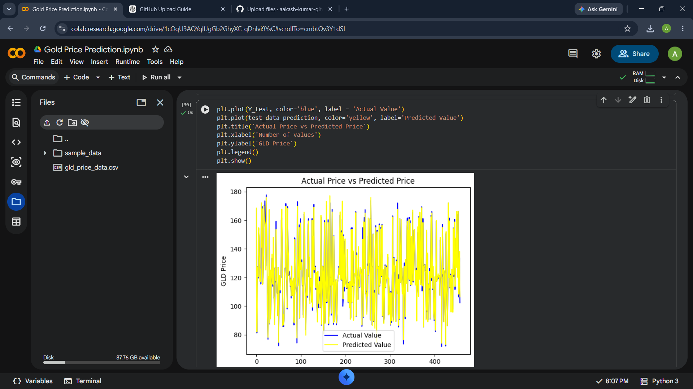

# Gold Price Prediction using Machine Learning

## Project Overview

This project predicts gold prices using Machine Learning algorithms in Python.

The project was developed using Google Colab as part of my Vocational Training.

## Dataset

Dataset: gld_price_data.csv

## Technologies Used

- Python
- Google Colab
- Pandas
- NumPy
- Matplotlib
- Seaborn
- Scikit-Learn

## Machine Learning Algorithm

- Random Forest Regressor

## Features

- Data preprocessing
- Exploratory Data Analysis
- Correlation Heatmap
- Model Training
- Prediction
- Performance Evaluation

## Project Structure

```
Gold-Price-Prediction-ML/
│
├── Gold_Price_Prediction.ipynb
├── gld_price_data.csv
├── requirements.txt
├── README.md
```

## How to Run

1. Clone this repository.
2. Install dependencies.

```
pip install -r requirements.txt
```

3. Open the notebook.

```
Gold_Price_Prediction.ipynb
```

4. Run all cells.

## Output



## Author

Aakash Kumar Singh